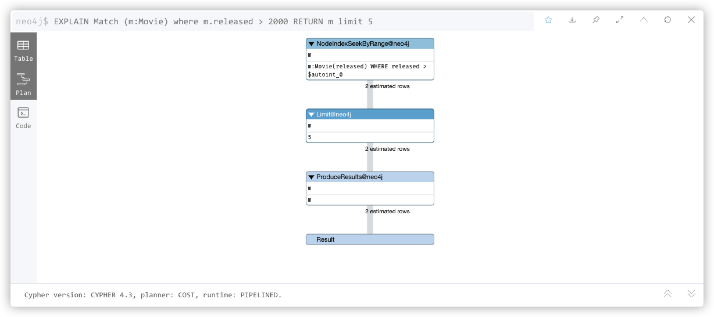
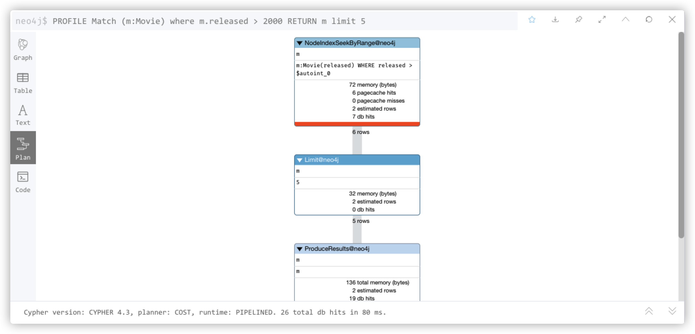
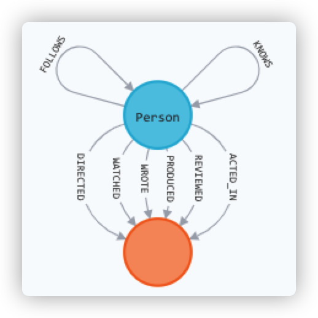

# Neo4j 性能优化

## 调试方法

ref <https://www.cnblogs.com/huyangshu-fs/p/12651919.html>

### EXPLAIN

EXPLAIN Cypher # 仅仅查看执行计划，不执行语句



### PROFILE

PROFILE Cypher # 运行语句，并全程监督资源使用情况

// TODO 这张图怎么看



### 查看索引

:schema # 查看索引创建情况

## 模式索引

ref

- <https://neo4j.com/docs/getting-started/current/cypher-intro/schema/>

在图数据库使用索引的目的是为了找到图遍历的起点。找到起点以后，后续遍历主要靠图结构，而不是索引了。

如果数据库已有数据，那么添加索引后要过一会才生效。可以用 `:schema` 查看索引是否生效。// todo 怎么看

比如要演员数据库，要按照 name 查找

`CREATE INDEX FOR (a:Actor) ON (a.name)`

以后按照 name 查找演员时，就不用遍历所有节点，而是能快速的定位到此 name 的演员 node。

```cypher
MATCH (actor:Actor { name: "Tom Hanks" })
RETURN actor;
```

也可以创建复合索引 composite index

`CREATE INDEX FOR (a:Actor) ON (a.name, a.born)`

约束 Constraints 用以保证 所有 Movie Node 的 title 是唯一的，同时也会自动创建索引

`CREATE CONSTRAINT ON (movie:Movie) ASSERT movie.title IS UNIQUE`

创建索引的所有方式见 <https://neo4j.com/docs/cypher-manual/current/administration/indexes-for-search-performance>

可视化查看索引 `CALL db.schema.visualization`



## 配置

ref

- <https://neo4j.com/docs/operations-manual/current/performance/memory-configuration/>
- <https://www.cnblogs.com/shixisheng/p/10717102.html>

neo4j.conf

```conf
dbms.memory.heap.initial_size=16g # 初始堆内存
dbms.memory.heap.max_size=16g # 最大堆内存
dbms.memory.pagecache.size=6g # 分页缓存
```

堆内存用于查询时的各种 Java 对象。受查询复杂度、深度、并发量影响。
分页缓存用于储存节点和关系的数据。这些数据如果内存里放不下的话，就只能放进磁盘进行交换，大大降低 IO 速度。

堆内存越大，速度越快，但要求小于物理内存。
建议 initial_size 和 max_size 设置为相等，避免 Full GC

可以在 shell 使用 `neo4j-admin memrec` 得到建议的内存分配值，但需要结合业务场景进行修改。也可以在 浏览器 使用 `:sysinfo` 查看信息。

比如 新建数据库，`neo4j-admin memrec` 输出

```text
Total size of lucene indexes in all databases: 6690m
Total size of data and native indexes in all databases: 35050m
```

导入 1/100 的数据，`neo4j-admin memrec` 输出

```text
Total size of lucene indexes in all databases: 6690m
Total size of data and native indexes in all databases: 35400m
```

估计全部数据所需内存 35.4GB - 35GB = 0.4GB * 100 = 40GB

再留 20% 余量 1.2 * (40GB) = 48GB

然后就设置 dbms.memory.pagecache.size=48GB

Stack Overflow Dump (6.2GB) 实例数据 包含 16.4M questions, 52k tags and 8.9M users，建议 pagecache 6G，heap 16G

## 架构设计

Neo4j 的节点上只存必要的数据，其他相关数据可以储存在 MySQL / MongoDB 中。

## 测试方法

ref <http://neo4j.com.cn/topic/5b497ac3d40e09d75e4d22a6>

以 <https://snap.stanford.edu/data/twitter-2010.txt.gz> 为数据源，压缩包大小 5.5 G，解压后文本文件 26.1 G。

```sh
wget https://snap.stanford.edu/data/twitter-2010.txt.gz

```

// todo 进行测试

## Cypher

ref

- <https://neo4j.com/developer/cypher/style-guide/>

1. 不使用 where 匹配 相等的 propertys

<https://neo4j.com/developer/cypher/filtering-query-results/#:~:text=Both%20queries%20execute%20with%20the%20same%20performance%2C%20so%20which%20way%20you%20write%20them%20is%20entirely%20up%20to%20your%20preference%20and%20comfort.>

✅ `MATCH (ee:Person{name:"Emil"}) RETURN ee;`
❎ `MATCH (ee:Person) WHERE ee.name = "Emil" RETURN ee;`

性能是一样的，但是第一种可读性上有提升。

## 预热

todo

<https://neo4j.com/developer/kb/warm-the-cache-to-improve-performance-from-cold-start/>
