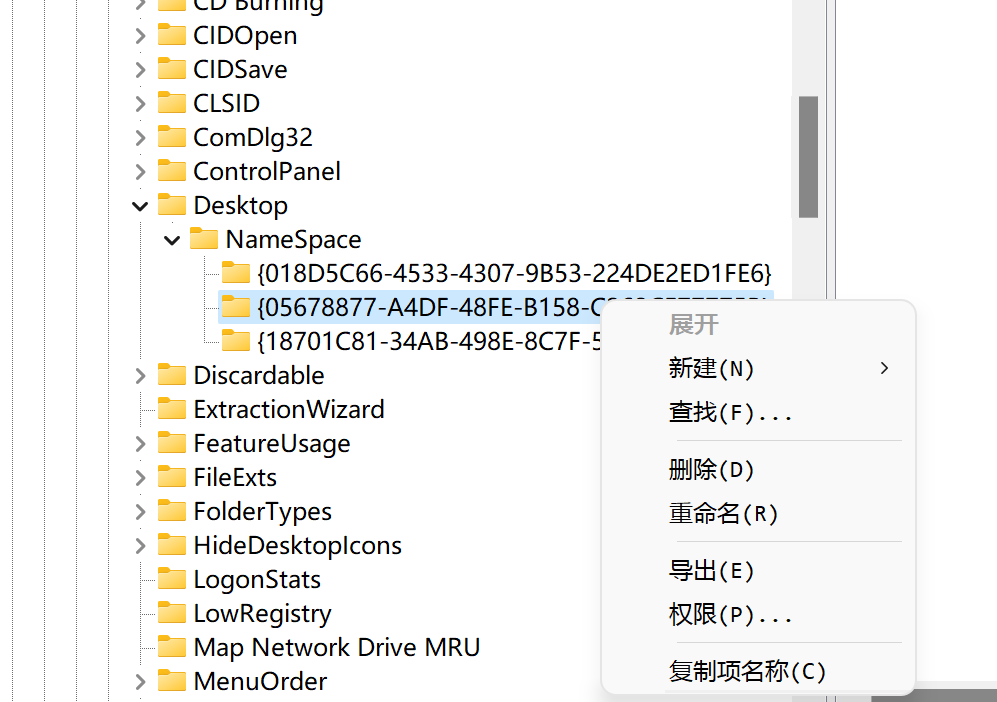

# 坚果云边栏图标删除

Windows 坚果云在安装的时候，会在资源管理器的边栏放一个图标，本文给出了删除此图标的方法。

Windows + R，输入 `regedit`，打开注册表编辑器

在上方的地址栏中输入 `计算机\HKEY_CURRENT_USER\Software\Microsoft\Windows\CurrentVersion\Explorer\Desktop\NameSpace`

并在左下方的 NameSpace 文件夹中浏览这几个文件（项）。这个文件夹下的每个项对应了边栏中的一个图标，需要找到坚果云对应的项。

看到其中的一个项，它的值中包含了 Nutstore，也就是坚果云

将此项删除，然后边栏中就没有坚果云了

