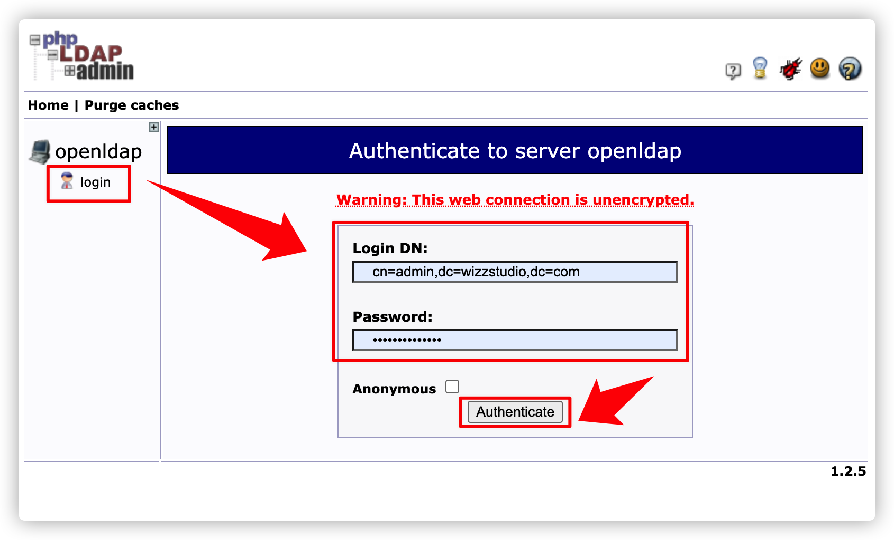
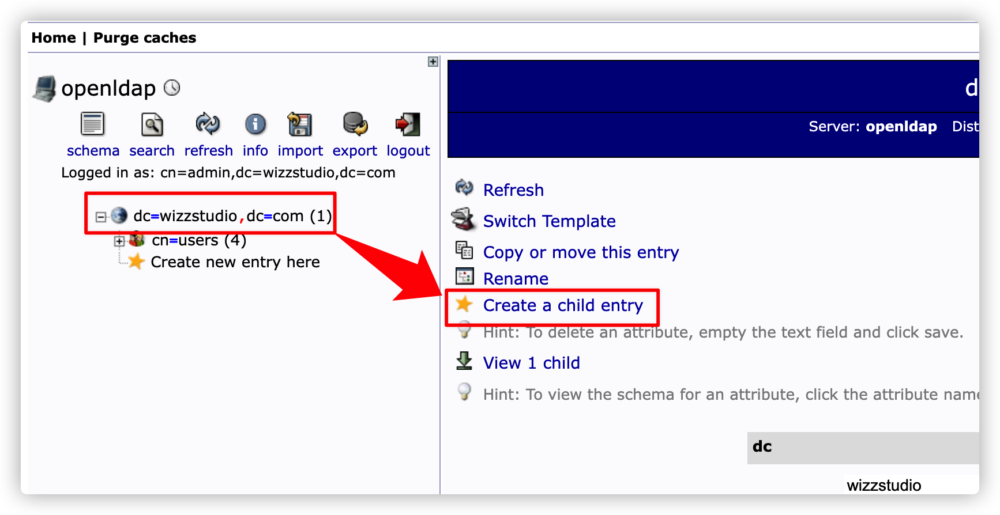
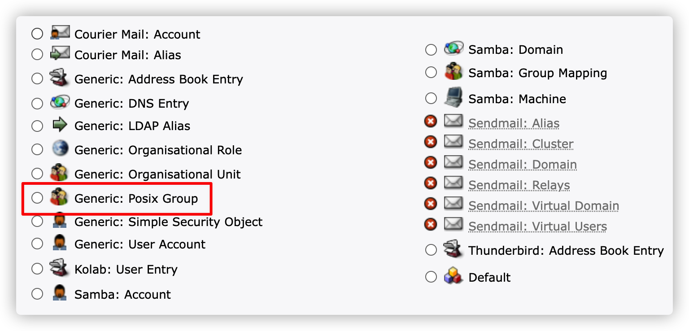
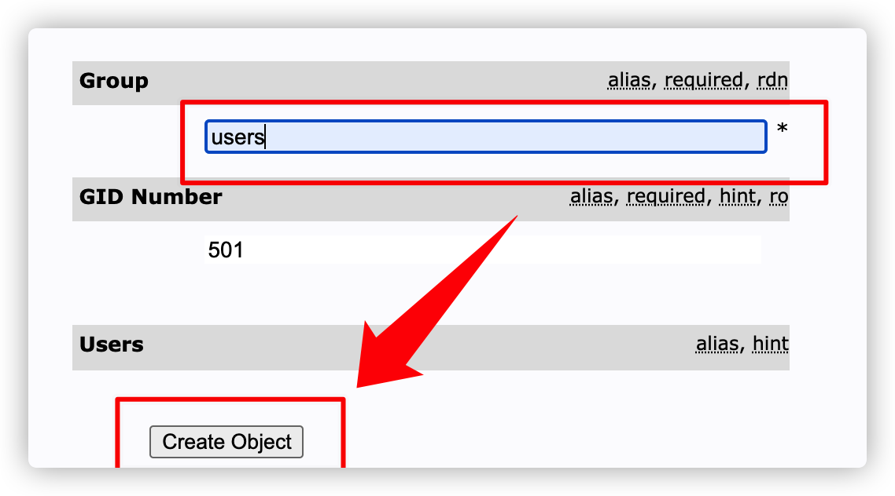
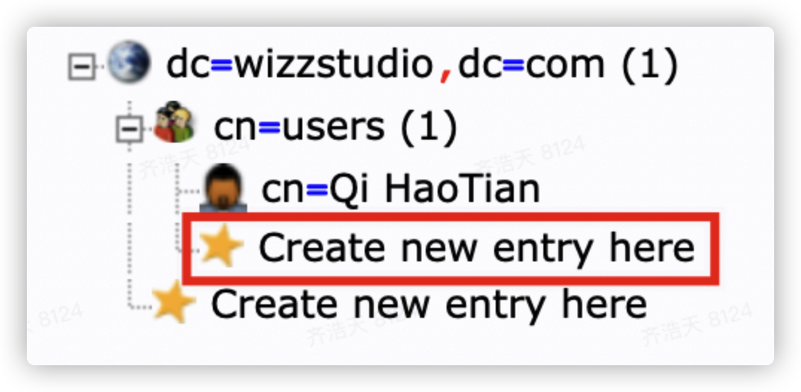
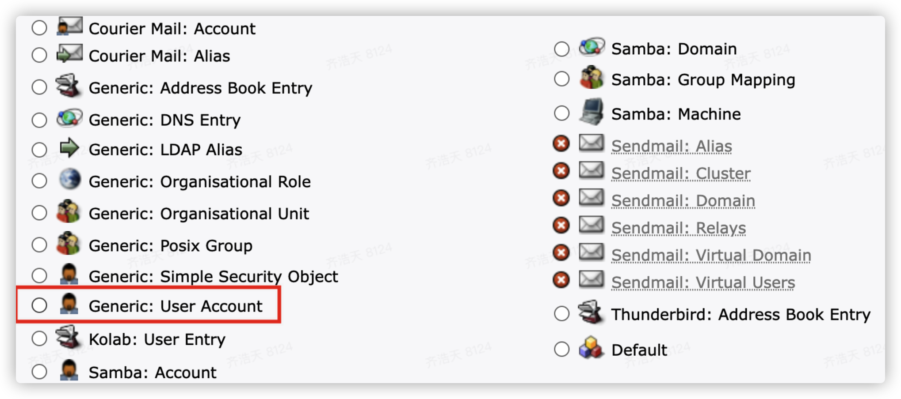
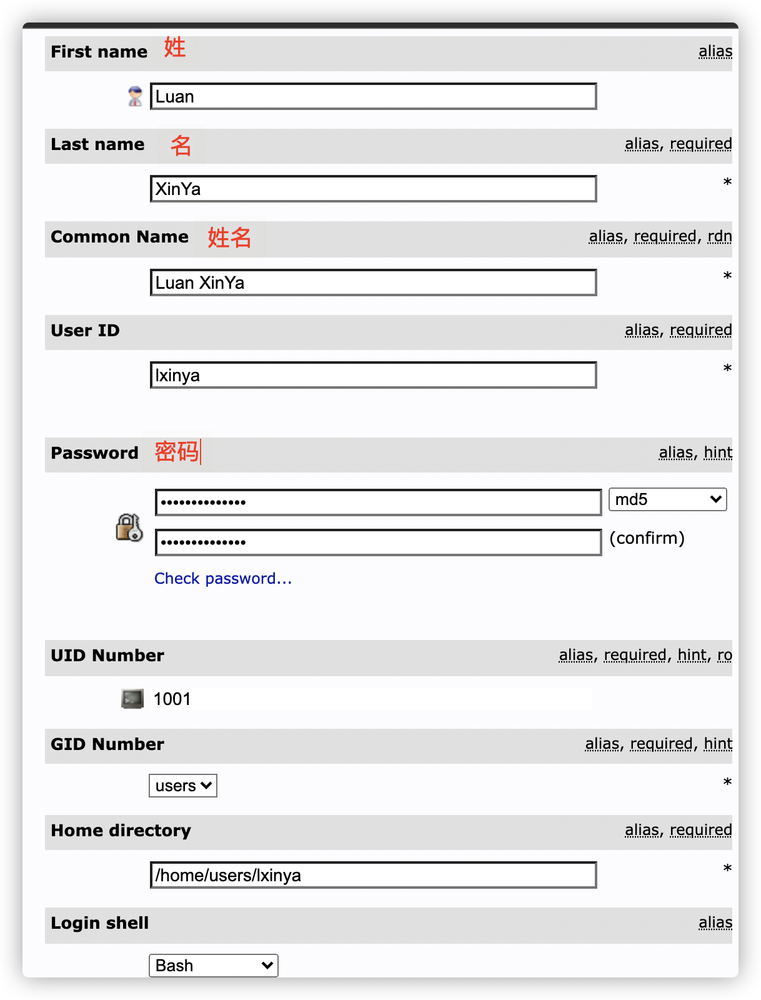
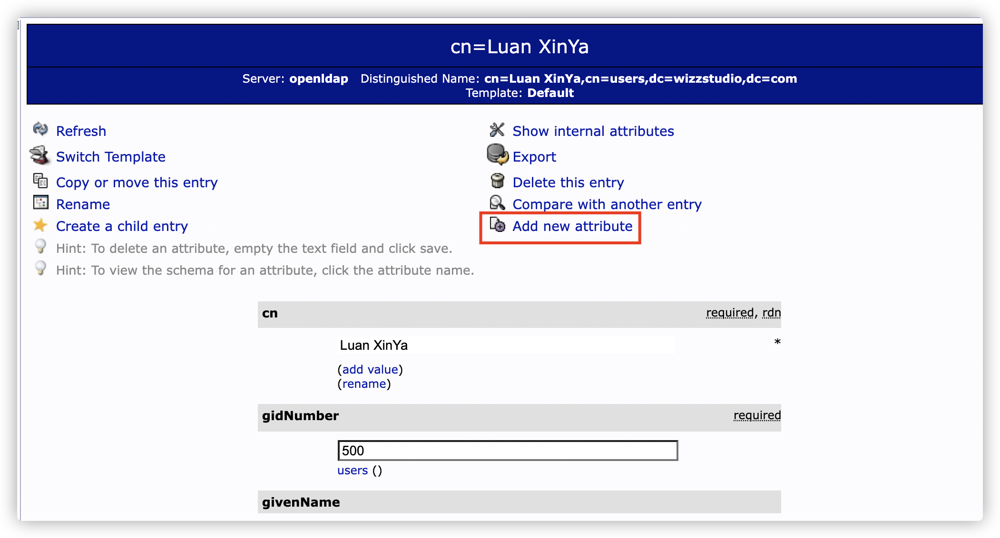
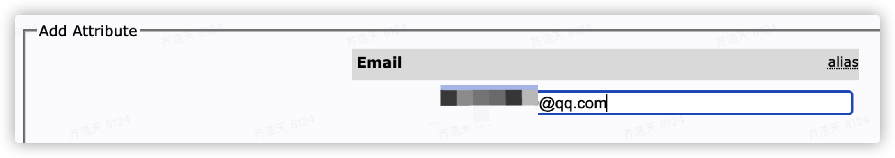

# LDAP 上手教程

本教程旨在让读者能快速入门 LDAP，并能快速应用到实战。

## 参考

- <https://cloud.tencent.com/developer/article/1649252>
- <https://segmentfault.com/a/1190000014683418>
- <https://www.jianshu.com/p/cce418c6a745>
- <https://cloud.tencent.com/developer/article/1193725>

## 介绍

在企业中，会部署很多套系统，比如 Gitlab、Nexus、Elastic 等。如果每个系统都有自己的一套账户系统，那么对用户来说，就太麻烦了。

有了 LDAP 以后，用户在 LDAP 服务器注册账号 -> 用户在 Gitlab 等系统输入账号密码进行登录 -> Gitlab 去查询 LDAP 服务器 账号密码 是否正确 -> LDAP 返回结果

这样就能做到所有系统共用 1 套账户体系了。

## 概念

LDAP 服务器就是一个树形的数据库，类似于 MySQL，一直运行，在某个端口上提供服务。可以用 osixia/openldap 这个 Docker 镜像。

怎么查看、修改数据呢？

1. 网页版编辑器

   phpmyadmin 是用 PHP 写的在线 MySQL 数据编辑器。类似的，phpldapadmin 是用 PHP 写的在线 LDAP 数据编辑器。通过 phpldapadmin 可以在网页上进行可视化的编辑。

2. 命令行

   在 osixia/openldap 镜像内，包含 ldapadd、ldapsearch 等命令行工具，类似于 MySQL 中的 MyCLI。

3. ldif

   类似于 MySQL 的 SQL 文件，包含了一系列操作。

建议主要在 phpmyadmin 进行操作。而且 phpmyadmin 也支持将数据、操作导出为 ldif，便于程序化执行。

## 部署

docker-compose.yml

```yaml
# https://github.com/osixia/docker-openldap/blob/master/example/docker-compose.yml

version: '3.9'
services:
  openldap:
    image: osixia/openldap
    container_name: openldap
    restart: unless-stopped
    environment:
      LDAP_LOG_LEVEL: "256"
      LDAP_ORGANISATION: "wizz Inc."
      LDAP_DOMAIN: "wizzstudio.com"
      LDAP_BASE_DN: ""
      LDAP_ADMIN_PASSWORD: "${password}"
      LDAP_CONFIG_PASSWORD: "${password}"
    tty: true
    stdin_open: true
    volumes:
      - "~/docker-compose/ldap/ldif:/root/ldif"
      - "~/docker_volume/ldap/data:/var/lib/ldap"
      - "~/docker_volume/ldap/config:/etc/ldap/slapd.d"
    ports:
      - "389:389"
      - "636:636"
    # For replication to work correctly, domainname and hostname must be
    # set correctly so that "hostname"."domainname" equates to the
    # fully-qualified domain name for the host.
    domainname: "wizzstudio.com"
    hostname: "basic"
  phpldapadmin:
    image: osixia/phpldapadmin
    container_name: phpldapadmin
    restart: unless-stopped
    environment:
      PHPLDAPADMIN_LDAP_HOSTS: "openldap"
      PHPLDAPADMIN_HTTPS: "false"
    ports:
      - "20001:80"
    depends_on:
      - openldap
```

.env

```ini
password=123456
```

然后 `docker-compose up -d` 即可，通过 20001 端口就能访问 phpldapadmin。

## 使用

admin 用户名密码

```text
Username: "cn=admin,dc=wizzstudio,dc=com" （和 LDAP_DOMAIN 有关）
Password: "123456" (.env中定义)
```



添加用户组









添加用户









## Gitlab 集成

在 gitlab.rb 中，设置为

```ruby
gitlab_rails['ldap_enabled'] = true
# gitlab_rails['prevent_ldap_sign_in'] = false

###! **remember to close this block with 'EOS' below**
gitlab_rails['ldap_servers'] = YAML.load <<-'EOS'
  main: # 'main' is the GitLab 'provider ID' of this LDAP server
    label: 'LDAP'
    host: 'basic.homelab'
    port: 389
    uid: 'cn' # 依据 LDAP Server 中 的 cn 属性判定为 登陆用户名

    bind_dn: 'cn=admin,dc=wizzstudio,dc=com' # Gitlab 用于查询 LDAP 服务器的账号
    password: '123456'

    encryption: 'plain'
    verify_certificates: false
    smartcard_auth: false
    active_directory: false # 不是 微软 的 域服务，而是 open-ldap
    allow_username_or_email_login: true
    lowercase_usernames: false
    block_auto_created_users: false
    base: 'dc=wizzstudio,dc=com'
    attributes:
      username: [ 'User Name'] # gitlab.example.com/<username>/project
      email:    ['Email']
      name:       'cn' # LDAP attribute for user display name
      first_name: 'givenName'
      last_name:  'sn'
    user_filter: ''
    ## EE only
    group_base: ''
    admin_group: ''
    sync_ssh_keys: false
EOS
```
