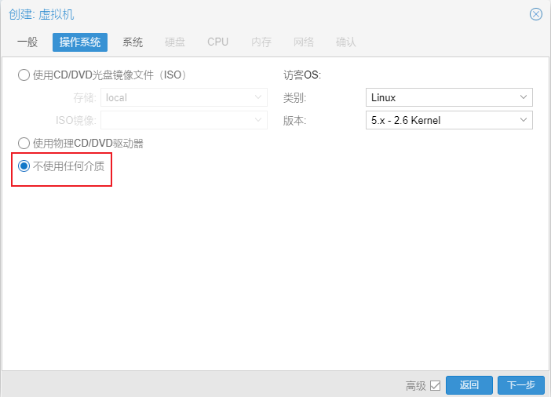
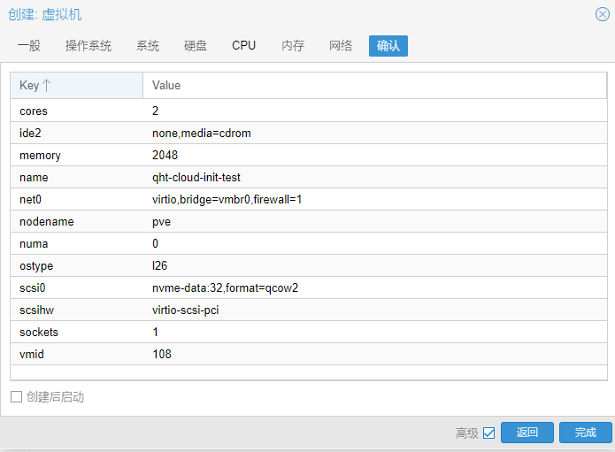
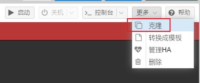

# PVE 安装 ArchLinux

## ISO

普通的安装模式

下载 ISO 镜像 <https://geo.mirror.pkgbuild.com/iso/latest/>，导入 local 储存

1. 创建虚拟机
2. 常规 - 开机自启动
3. 操作系统 - 选择 ISO 镜像
4. 系统 - Qemu 代理，BIOS - OVMF (UEFI)，EFI 储存 - local-lvm，取消勾选预注册密钥
5. 硬盘 - 改变磁盘大小，如果是 SSD 硬盘则勾选 SSD 仿真、丢弃(Trim)
6. CPU - 类别 host，修改插槽、核心数
7. 内存 - 修改内存大小
8. 网络 - 不变

进入系统后，使用 archinstall 进行安装

## Cloud-init

ref [在 Proxmox VE pve 里使用 cloud-init 构建（centos\ubuntu\debian）cloud images | 佛西博客](https://foxi.buduanwang.vip/virtualization/pve/388.html/) [Cloud-init 使用](https://otkyd4jmkr.feishu.cn/wiki/wikcneGcizXquLGvLXGPceATxdf)








完成添加


```apache
cd /var/lib/vz/images
qm importdisk 108 CentOS-7-x86_64-GenericCloud-2009.qcow2 nvme-data --format=qcow2
qm importdisk 110 ubuntu-22.04-server-cloudimg-amd64.img nvme-data
qm importdisk 113 k3os-amd64.iso nvme-data

qm importdisk 106 Arch-Linux-x86_64-cloudimg-20230301.130409.qcow2 local-lvm
```

108 表示新建虚拟机的编号

CentOS-7-x86_64-GenericCloud-2009.qcow2 为镜像名

NVME 为储存池名

Cloud-init 镜像下载路径 [在 Proxmox VE pve 里使用 cloud-init 构建（centos\ubuntu\debian）cloud images | 佛西博客](https://foxi.buduanwang.vip/virtualization/pve/388.html/)

ArchLinux 在 [https://geo.mirror.pkgbuild.com/images/](https://geo.mirror.pkgbuild.com/images/)


Ip 设置，可以是 DHCP，然后去 openwrt 找 分配到的 ip

也可以直接静态设置 ip


然后也可以将这个虚拟机转换成模板，批量进行创建





