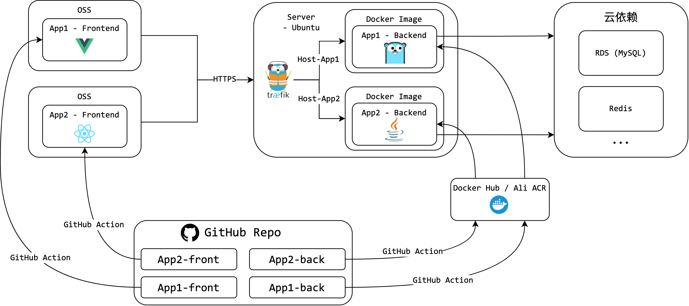

# 中小型应用运维

参考 <https://mp.weixin.qq.com/s/dA_LSS-d0Kcl3ZP9DjYVig>

在我们学习开发的过程中，经常会有一些玩具项目或者用户数量较少的项目需要运维。这类项目的特点是并发量较小、资源占用低、外部组件依赖简单。本节会介绍这些项目的运维模式及相关实践，为类似的项目运维提供参考。

## 架构

运维的主要目标是高可用。其次是做到自动化，尽量减少后续的运维操作。最后，希望成本支出也比较低。

综上考虑，架构图如下



出于高可用的要求，后端需要部署在云服务器上。为了降低成本，可以把所有的后端都放在一台服务器上。一般来说服务器的带宽也是很低的，所以可以把前端部署在 OSS 上面。至于 MySQL 这类组件，可以使用阿里云 RDS，也可以部署在自己的云服务器上。

云服务器使用学生机，10 元 1 月。OSS 在低访问量下的价格可以忽略，RDS 活动价 60 元 3 年。所以整体的成本是相当低的。

然后是软件层面。云服务器操作系统可以选用自己喜欢的一个 Linux 发行版，比如 Ubuntu。我甚至在很多服务器上使用了 ArchLinux，也能做到较高的稳定性。

在云服务器上要运行多个后端。为了将 HTTP 请求正确路由到对应的后端，可以借助网关根据 Header 中的 Host 字段进行路由。此外，网关还可以提供 HTTPS 功能。我选用 Traefik 作为网关。相比 Nginx，Traefik 可以自动配置 Docker 容器的路由，且集成 Let's Encrypt 自动申请、维护泛域名 HTTPS 证书。

Traefik 网关的 Docker 部署方式如下

首先创建网络 `docker network create traefik`

文件中的 `${}` 需要根据自己实际情况编写

```yaml
# ~/.docker/traefik/docker-compose.yml

version: "3.3"
services:
  traefik:
    image: traefik
    ports:
      - "443:443"
    volumes:
      - /var/run/docker.sock:/var/run/docker.sock

      - ./config/traefik.yml:/etc/traefik/traefik.yml
      - ./config/dynamic_conf.yml:/root/dynamic_conf.yml

      - ./data/crt:/root/crt
      - ./data/log:/root/log
    restart: unless-stopped
    networks:
      - traefik
    environment:
        ALICLOUD_ACCESS_KEY: ${AK}
        ALICLOUD_SECRET_KEY: ${SK}
    extra_hosts:
      - "host.docker.internal:172.18.0.1" # 172.18.0.1 是容器访问宿主机的 ip，通过 docker inspect 获取
networks:
  traefik:
    external: true
```

请确保 `*.be.wizzstudio.com` 域名解析至这台服务器；配置中 `root:$2b$12$aur8GtnfMi` 是 Traefik Basic Auth 账号密码，通过 <https://doc.traefik.io/traefik/middlewares/basicauth> 生成。

```yaml
# ~/.docker/traefik/config/dynamic_conf.yml
http:
  middlewares:
    basic-auth:
      basicAuth:
        users:
          - "root:$2b$12$aur8GtnfMi"

  routers:
    dashboard:
      rule: "Host(`traefik.be.wizzstudio.com`)"
      service: "api@internal"
      middlewares:
        - basic-auth
      tls:
        certResolver: myresolver
        domains:
        - main: '*.be.wizzstudio.com'
        - sans: '*.be.wizzstudio.com'
```

```yaml
# ~/.docker/traefik/config/traefik.yml
providers:
  docker:
    exposedByDefault: false
    network: traefik
  file:
    filename: /root/dynamic_conf.yml
    watch: true

api:
  dashboard: true
  # insecure: true

entryPoints:
  https:
    address: ":443"
    http:
      tls:
        certresolver: myresolver

certificatesResolvers:
  myresolver:
    acme:
      dnsChallenge:
        provider:   alidns
        delayBeforeCheck: 0
      storage: /root/crt/acme.json
      # caserver:   "https://acme-staging-v02.api.letsencrypt.org/directory" # test server
accessLog:
  filePath: "/root/log/access.log.json"
  format: "json"
```

通过 `docker-compose up -d` 完成网关的部署；通过访问 <https://traefik.be.wizzstudio.com> 即可进入管理面板。

## 后端部署

以某一个后端项目的部署为例。

后端项目都需要进行容器化。容器化的优点在于环境隔离，避免不同后端的环境冲突。首先在项目根目录准备 Dockerfile, 将项目从源代码开始构建为二进制。

以下为 Golang Web 项目 Dockerfile 的一个示例。

```Dockerfile
FROM golang:1.18.0-alpine3.15 as build
LABEL maintainer="117503445"
RUN apk add --no-cache git
WORKDIR /root/project
COPY go.mod .
COPY go.sum .
RUN go mod download
COPY . .
RUN go build -ldflags="-s -w" -o server

FROM alpine:3.15 as prod
EXPOSE 8080
WORKDIR /root

# https://stackoverflow.com/questions/66963068/docker-alpine-executable-binary-not-found-even-if-in-path
RUN apk add gcompat

COPY --from=build /root/project/server server
HEALTHCHECK --interval=5s --timeout=5s --retries=3 \
    CMD wget -nv -t1 --spider 'http://localhost:8080/' || exit 1
ENTRYPOINT ./server
```

然后在云服务器上通过 Docker Compose 进行服务的部署。

```yaml
# /root/.docker/orientation-system-be/docker-compose.yml
version: "3.3"
services:
  backend:
    image: registry.cn-chengdu.aliyuncs.com/wizz-project/orientation-system-be:latest
    restart: unless-stopped
    labels:
      - "traefik.enable=true"
      - "traefik.http.routers.orientation-system-be.rule=Host(`orientation-system.be.wizzstudio.com`)"
      - "traefik.http.routers.orientation-system-be.tls=true"
      - "traefik.http.services.orientation-system-be.loadbalancer.server.port=80"
    networks:
      - traefik
    volumes:
      - /etc/timezone:/etc/timezone:ro
      - /etc/localtime:/etc/localtime:ro

      - ./data/lab.log:/root/lab.log
networks:
  traefik:
    external: true
# mkdir -p ~/.docker/volume/orientation-system-be && touch ~/.docker/volume/orientation-system-be/lab.log
```

通过 labels 字段，定义了通过 <https://orientation-system.be.wizzstudio.com> 即可访问到这个容器，不需要再去 Traefik 修改路由配置了。

## CI/CD

CI/CD 即持续集成与持续交付，用于实现应用开发过程中的高度持续自动化和持续监控。CI/CD 的目标是用户上传代码后，自动构建镜像，自动部署到服务器。使用 GitHub Action 完成此功能。

### 后端 

编写 GitHub Action，并在 Repo 中的 secrets 填写 阿里云容器镜像服务的 AK 和 SK。这里经过修改，也可以变为上传至 Docker Hub。

```yaml
# .github/workflows/docker.yml
name: Build and Deploy to ACK

on:
  push:
    branches:
      - main

# Environment variables available to all jobs and steps in this workflow.
env:
  REGION_ID: cn-chengdu
  REGISTRY: registry.cn-chengdu.aliyuncs.com
  NAMESPACE: wizz-project
  IMAGE: experiment-helper-backend
  TAG: ${{ github.sha }}

jobs:
  build:
    runs-on: ubuntu-latest
    environment: production

    steps:
      - name: Checkout
        uses: actions/checkout@v2
        
        # 1.1 Login to ACR
      - name: Login to ACR with the AccessKey pair
        uses: aliyun/acr-login@v1
        with:
          region-id: "${{ env.REGION_ID }}"
          access-key-id: "${{ secrets.ACCESS_KEY_ID }}"
          access-key-secret: "${{ secrets.ACCESS_KEY_SECRET }}"      

        # 1.2 Buid and push image to ACR
      - name: Build and push image to ACR
        run: |
          docke build --tag "$REGISTRY/$NAMESPACE/$IMAGE:$TAG" .
          docker push "$REGISTRY/$NAMESPACE/$IMAGE:$TAG"
          docker tag "$REGISTRY/$NAMESPACE/$IMAGE:$TAG" "$REGISTRY/$NAMESPACE/$IMAGE:latest"
          docker push "$REGISTRY/$NAMESPACE/$IMAGE:latest"
```

每次在 main 分支 commit 后，都会触发 GitHub Action，并将镜像推送至阿里云容器服务。也可以根据 GitHub Flow 等分支管理策略，修改触发条件。

在完成 Docker 镜像的推送后，可以使用 Watchtower 实现镜像的自动拉取、更新。同样使用 Docker Compose 部署 Watchtower。

```yaml
# /root/.docker/watchtower/docker-compose.yml
version: "3.3"
services:
  watchtower:
    image: containrrr/watchtower
    restart: unless-stopped
    volumes:
      - /var/run/docker.sock:/var/run/docker.sock
      - ~/.docker/config.json:/config.json
    command: --interval 60 --cleanup --debug
```

### 前端

同样使用 GitHub Action。每次发生代码提交后，都进行构建，再将 dist 文件夹上传至 OSS。

```yaml
# .github/workflows/oss.yml
name: oss

on:
  push:
    branches:
      - main

jobs:
  build:
    runs-on: ubuntu-latest
    steps:
      - name: checkout
        uses: actions/checkout@v1

      - name: install node
        uses: actions/setup-node@v2
        with:
          node-version: "14"

      - name: build dist
        run: |
          npm install -g yarn
          yarn install
          yarn build
      - name: upload files to OSS
        uses: fangbinwei/aliyun-oss-website-action@v1
        with:
          accessKeyId: ${{ secrets.ACCESS_KEY_ID }}
          accessKeySecret: ${{ secrets.ACCESS_KEY_SECRET }}
          bucket: experiment-helper-mobile
          endpoint: https://oss-cn-hangzhou.aliyuncs.com
          folder: ./dist/build/h5  
```

## 日志管理

对于更大规模的生产环境，可能需要ELK或者阿里云日志服务等专业的日志解决方案，但是这些解决方案对于本使用场景来说过重了。

我们的目标为，每个应用的开发者都可以下载到自己应用的日志文件。作者开发过一个小工具，<https://github.com/117503445/GoWebDAV>。

GoWebDAV 可以将服务器上的文件夹以 WebDAV 的形式暴露出来，并支持浏览器在线访问、挂载多个路径、路径粒度的 Basic Auth 及只读控制。对于这个场景，小工具也可以轻松解决需求。

在上述 orientation-system 项目的部署中，可以观察到将镜像内的 /root/lab.log 挂载到了宿主机的 ~/.docker/orientation-system-be/data/lab.log。

通过 Docker Compose 部署 GoWebDAV。相关配置规则可查看 repo 上的 README。

```yaml
# /root/.docker/go_webdav/docker-compose.yml
version: "3.3"
services:
  webdav:
    image: 117503445/go_webdav
    restart: unless-stopped
    volumes:
      - ~/.docker/orientation-system-be/data:/root/orientation-system-be
    environment:
      - dav=/orientation-system-be,/root/orientation-system-be,user1,pass1,true
    networks:
      - traefik
    labels:
      - "traefik.enable=true"
      - "traefik.http.routers.webdav.rule=Host(`webdav.be.wizzstudio.com`)"
      - "traefik.http.routers.webdav.tls=true"
      - "traefik.http.services.webdav.loadbalancer.server.port=80"
networks:
  traefik:
    external: true
```

通过这样配置，开发者就可以通过访问 https://webdav.be.wizzstudio.com/orientation-system-be 访问日志文件了。用户名 user1，密码 pass1，而且只具有只读权限。

同一个 GoWebDAV 镜像支持多个文件夹路径，因此服务器上只用部署 1 个 GoWebDAV 即可。

## 分支模型

自己开发小项目的时候，只用在 master 上随意 push 即可。但是项目上线 / 多人协作时，就需要使用分支功能了。最简单的分支模型是 [GitHub Flow](https://docs.github.com/en/get-started/quickstart/github-flow), 主分支是最新的 release，每写个功能就从主分支最新提交 fork 出一个分支，写完功能后再把功能分支 merge 回主分支。


对于更复杂的项目，可以用 Git Flow。CI/CD 相关的 workflows 也应适配分支结构。


## Serverless

Serverless 即无服务器计算 / 函数计算，相当于把容器镜像交给阿里云。用户进行请求的时候，阿里云才将容器分配到实例上。没有请求的时候，就不会有运行的实例，也不会产生费用了。

但是 不是所有的后端都可以直接放到 Serverless 上。比如有些后端自己维护定时任务，必须长时间运行，就不适合 Serverless 事件驱动的范式。此外，后端的启动时间不应过长，否则冷启动会给用户带来好几秒的延迟，体验就很差了。大多数 Spring Boot 项目的启动时间都很长，就不适合 Serverless 了。尽管 Spring Native 可以缩短启动时间，但是会限制对反射等语法的使用。