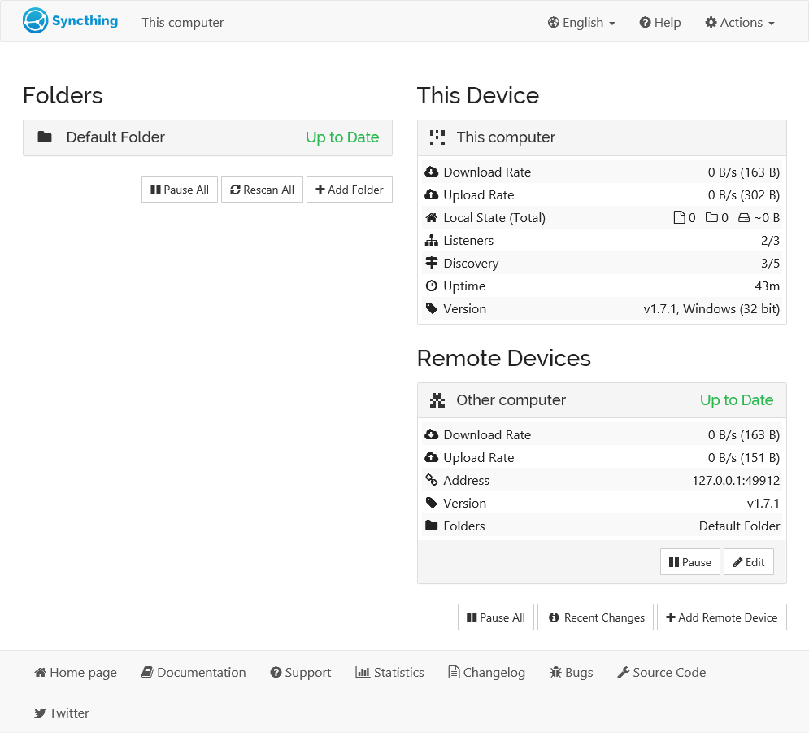
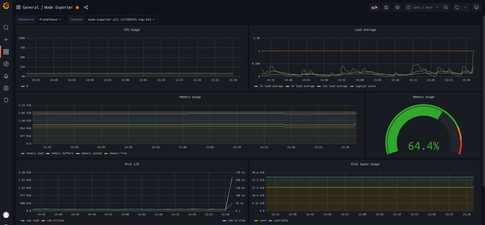
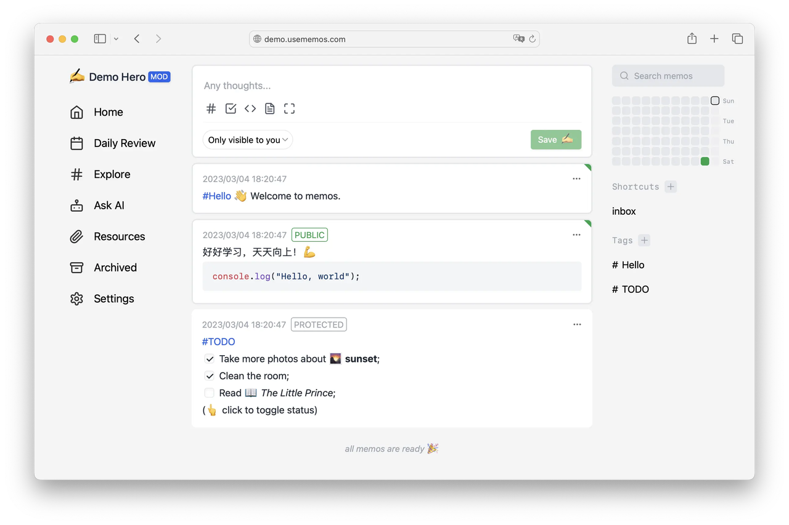
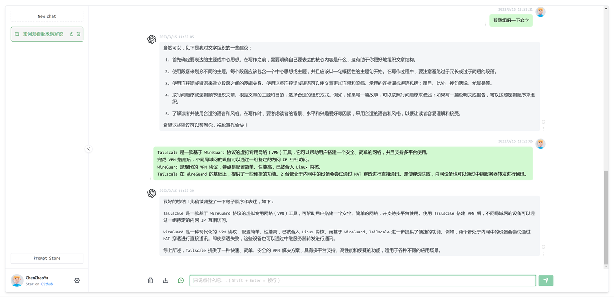
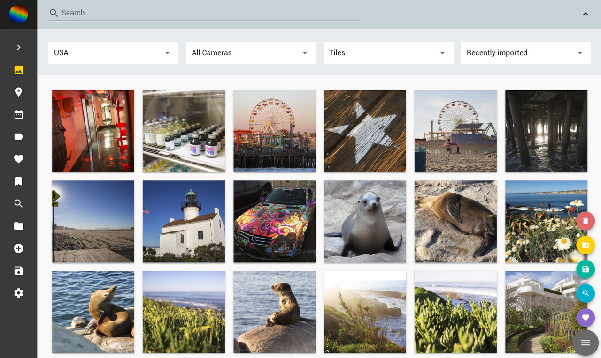

# 实用的自部署服务

## Syncthing 文件夹同步

类似于百度网盘的工作空间。对我来说，我使用 Syncthing 进行课程文件夹的同步。上课的时候，在笔记本上把相关文件放进去；回去就可以在台式电脑上也看到相关的文件了。我的照片数据也通过 Syncthing 进行异地备份。

Syncthing 需要在每个设备上安装，然后就会通过设备发现自动选择最优的传输路径。



```yaml
version: "3.9"
services:
  syncthing:
    image: syncthing/syncthing
    restart: unless-stopped
    ports:
      - 8384:8384
      - 22000:22000/tcp
      - 22000:22000/udp
    volumes:
      - ./data:/var/syncthing
```

## Prometheus 监控

通过 Prometheus 全家桶进行机器和应用性能的监控。并在内存使用率较高时钉钉报警。



配置文件有大几百行，就不放了，需要用的可以联系我

## Uptime Kuma 网站可用性

监控网站是否可用，输出近期的网站可用率，并在网站不可用时进行钉钉报警。


```yaml
version: "3.9"

services:
  uptime-kuma:
    image: louislam/uptime-kuma:1
    container_name: uptime-kuma
    volumes:
      - ./data:/app/data
      
      - /etc/localtime:/etc/localtime:ro
      - /etc/timezone:/etc/timezone:ro
    restart: unless-stopped
    ports:
       - 3001:3001
```

## Memos 笔记

可以很方便的在不同设备之间传输 文字、图片、文件



```yaml
version: "3.9"

services:
  memos:
    image: neosmemo/memos
    restart: unless-stopped
    volumes:
      - ./data:/var/opt/memos

      - /etc/localtime:/etc/localtime:ro
      - /etc/timezone:/etc/timezone:ro
```

## ChatGPT-Web

基于 API 便捷的访问 ChatGPT。优点在于界面、响应流畅，使用者不需要科学上网。



```yaml
version: '3'

services:
  chatgpt-web:
    image: chenzhaoyu94/chatgpt-web # 总是使用 latest ,更新时重新 pull 该 tag 镜像即可
    ports:
      - 3002:3002
    environment:
      # 二选一
      OPENAI_API_KEY: sk-*****
      # 二选一
      # OPENAI_ACCESS_TOKEN: xxxxxx
      # API接口地址，可选，设置 OPENAI_API_KEY 时可用
      # OPENAI_API_BASE_URL: xxxx
      # 反向代理，可选
      # API_REVERSE_PROXY: xxx
      # 超时，单位毫秒，可选
      TIMEOUT_MS: 60000
      # Socks代理，可选，和 SOCKS_PROXY_PORT 一起时生效
      # SOCKS_PROXY_HOST: xxxx
      # Socks代理端口，可选，和 SOCKS_PROXY_HOST 一起时生效
      # SOCKS_PROXY_PORT: xxxx
```

## PhotoPrism 照片管理

类似于谷歌相册，管理自己的照片。

