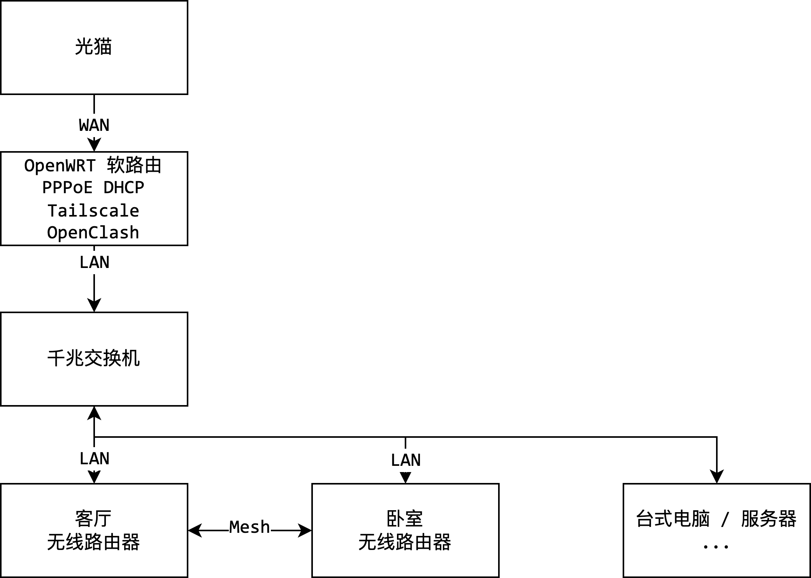
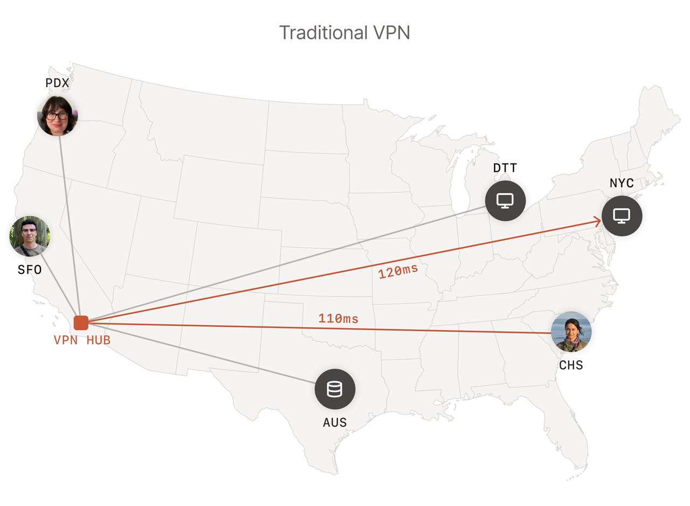
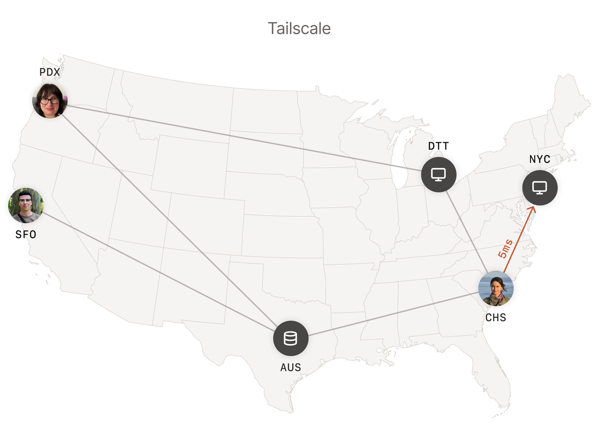
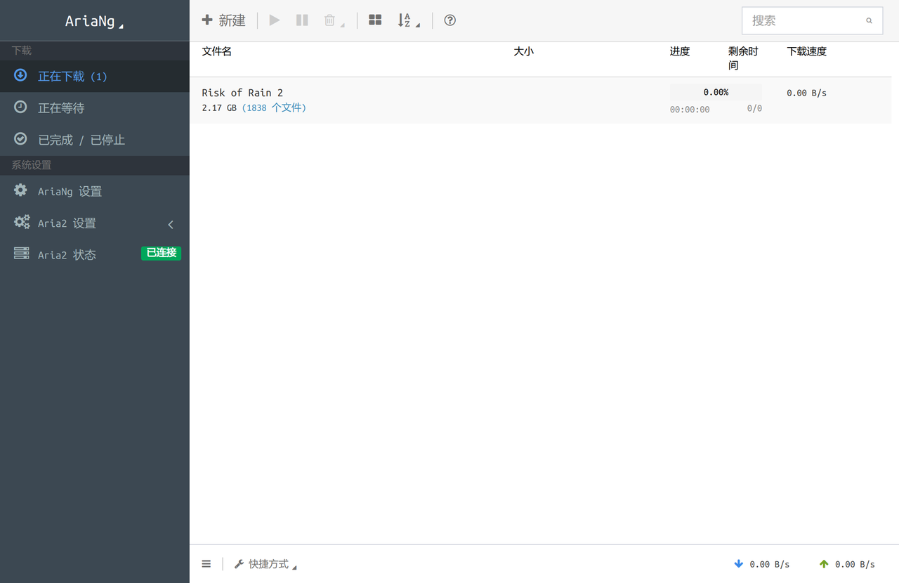

# 家用网络

通过折腾家用网络，可以得到以下好处

1. 更好的无线网络覆盖
2. 廉价的计算/存储设备。

    云服务器的价格是昂贵的。对于没有学生价、优惠价的云服务器，往往 1 - 3 月的租金就可以买一台同配置的物理机了。另外就是云服务器的带宽也很贵，而家庭网络具有 100 mbps 以上的带宽 和 40 mbps 的上行带宽，且不用额外支付费用。

## 网络拓扑

我的家庭网络拓扑如下



光猫改为桥接模式，接到软路由上。软路由安装 OpenWRT 系统，是网络的核心部分，负责 PPPoE 拨号，也通过 DHCP 分配 IP。网络内所有设备的 IP 都由软路由进行分配，可以互相访问，从而形成了扁平的内网。

## Wi-Fi

我推荐有线 Mesh 的方案，可以实现便捷的无缝切换。具体可参考 <https://zhuanlan.zhihu.com/p/343117525>。其他方案有 AC-AP，无线桥接等。

### 工具

- [WiFiman](https://play.google.com/store/apps/details?id=com.ubnt.usurvey&hl=en_US&pli=1) 扫描 Wi-Fi 信号强度、绘制 Wi-Fi 热力图。

- [OpenSpeedTest](https://openspeedtest.com/selfhosted-speedtest) 测量 LAN 速度。

## 代理

在路由器上安装 OpenClash 进行透明代理。避免在多个设备上分别安装代理软件、相关设置。后来为了规避路由器性能不足的问题，我使用了旁路由方案，可参考 <https://wiki.117503445.top/practice/Clash%20%E6%97%81%E8%B7%AF%E7%94%B1%20%26%20%E9%80%8F%E6%98%8E%E4%BB%A3%E7%90%86/>。

## Tailscale

Tailscale 是一款基于 WireGuard 协议的虚拟专用网络（VPN）工具，它可以帮助用户搭建一个安全、简单的网络，并且支持多平台使用。

完成 VPN 搭建后，不同局域网的设备可以通过一组特定的内网 IP 互相访问。WireGuard 是现代的 VPN 协议，特点是配置简单、性能高，已被合入 Linux 内核。Tailscale 在 WireGuard 的基础上，提供了一些便捷的功能。2 台都处于内网中的设备会尝试通过 NAT 穿透进行直接通讯。即使穿透失败，内网设备也可以通过中继服务器转发进行通讯。





## HomeLab

我在家里购置了 Dell R630 服务器，E5-2696V4*2(44核88线程) 128G 内存，只需要 6000￥

用途

- 开发

  我会使用笔记本或者台式电脑。开发项目时，在不同设备上搭建环境、同步代码都很繁琐。所以在 HomeLab 上开一个虚拟机，把所有项目代码、环境都放在上面，使用不同设备的时候都远程连接到这个虚拟机上进行开发，就比较方便。这样还可以规避设备性能不足的问题，轻薄本也能获得完善的开发体验。

- K8s 集群

  很方便的在服务器上开出 4 台 8c8g 的虚拟机，然后搭建 K8s 集群进行测试。

- 对外服务

  操作系统课 eBPF 环境 / 联邦学习环境 搭建比较繁琐，可以在 HomeLab 上搭建好以后开放给小组同学用，就不需要每个人各自搭一遍环境了。

## DDNS

> 前提是已经获取到了公网 IP。

家庭网络的 IP 在每次拨号时都会发生变化。就算没有重启光猫，过几天也会分配到新的 IP。通过 DDNS，可以将固定的域名解析到动态的 IP 上。

```yaml
version: "3.9"

services:
  ddns:
    image: newfuture/ddns
    restart: unless-stopped
    network_mode: "host"
    volumes:
      - ./config/config.json:/config.json
```

```json
// ./config/config.json
{
    "$schema": "https://ddns.newfuture.cc/schema/v2.8.json",
    "id": "ak",
    "token": "sk",
    "dns": "alidns",
    "ipv4": ["example.com"],
    "ipv6": ["example.com"],
    "index4": "url:https://myip4.ipip.net/",
    "index6": "url:https://myip6.ipip.net/",
    "ttl": 600,
    "debug": true
}
```

## Wake on LAN

家用电脑一般是关机的。当在外面想控制家里的电脑中，需要先开机。Wake on LAN 协议可以通过发送一个局域网内的包来唤醒电脑。

我写了一个 http 的 [WOL](https://github.com/117503445/wake_on_lan_server) 服务。可以将 WOL 服务部署在内网设备上，然后在外网访问 WOL 服务。开机后，就可以使用 RDP 之类的协议控制家里的电脑了。


```yaml
version: "3.9"
services:
  wol:
    image: 117503445/wake_on_lan_server
    restart: unless-stopped
    network_mode: "host"
    volumes:
      - ./config/config.json:/app/config.json
```

```json
// ./config/config.json
{
    "mac": "88:a4:c2:d6:8f:42",
    "broadcast": "192.168.2.255"
}
```

对于不一定支持 WOL 的笔记本，可以设置来电自动开机，然后把电源适配器插在米家智能插座上。

## K8s

云服务器稳定但是昂贵，家庭服务器不稳定但是便宜。可以借助 K8s，实现稳定、廉价的 Web 服务。

思路就是云服务器负责控制、流量入口，工作负载运行在家用服务器上。云服务器将流量转发到家用服务器上，如果某一台家用服务器失效了，控制平面会把工作负载转移到另一台家用服务器上。

具体的，可以使用 Tailscale 进行组网，然后使用 K3s 进行部署。K3s 是 K8s 的发行版，主打轻量，所以 2G 内存的 K3s 也可以运行控制平面。具体可以参考 <https://www.117503445.top/2023/02/12/2023-02-12-K3s%20%E8%B7%A8%E4%BA%91%E9%9B%86%E7%BE%A4%E9%83%A8%E7%BD%B2%E5%AE%9E%E8%B7%B5/>

## Aria2

挂机下载 BT / HTTP



```yaml
# export UID=id -u
# export %GID=id -g
version: "3.9"
services:
  aria2:
    image: p3terx/aria2-pro
    restart: unless-stopped
    volumes:
      - ~/data/config:/config
      - ~/data/downloads:/downloads
    network_mode: "host"
    environment:
      PUID: 1000
      PGID: 1000
      RPC_SECRET: *****
      RPC_PORT: 6800
      LISTEN_PORT: 6888
```
