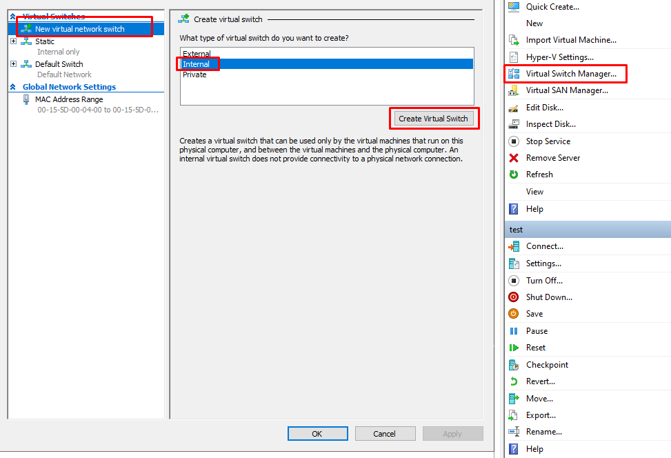
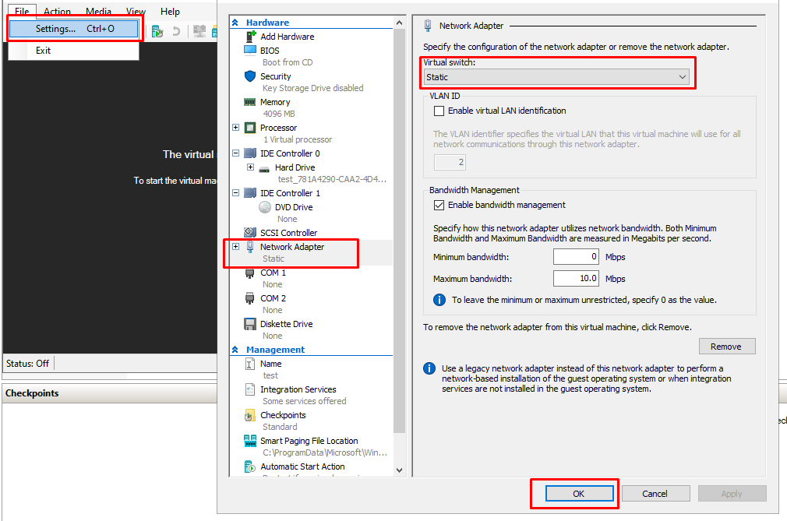
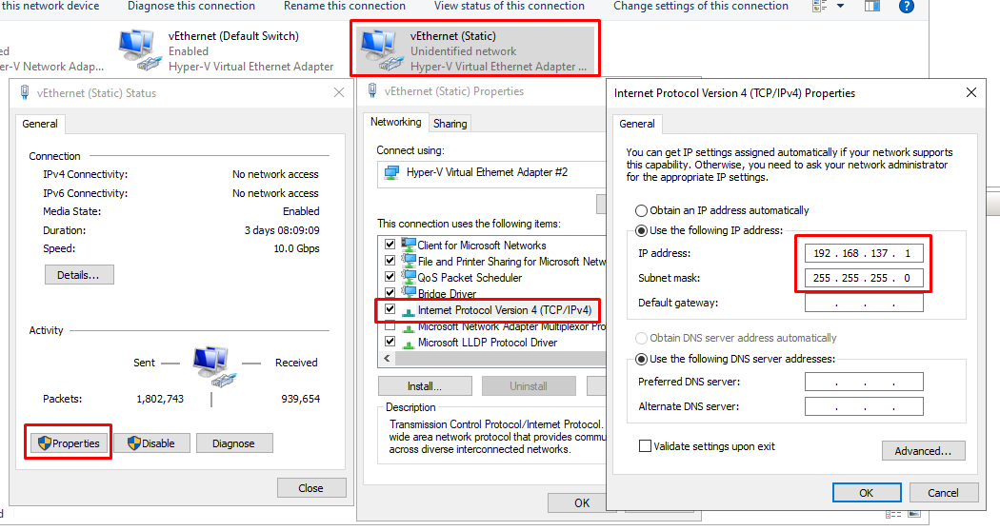
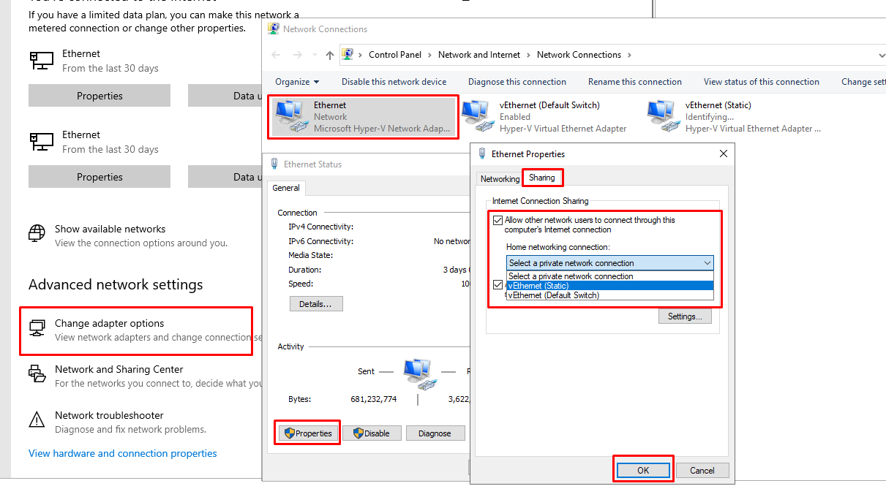
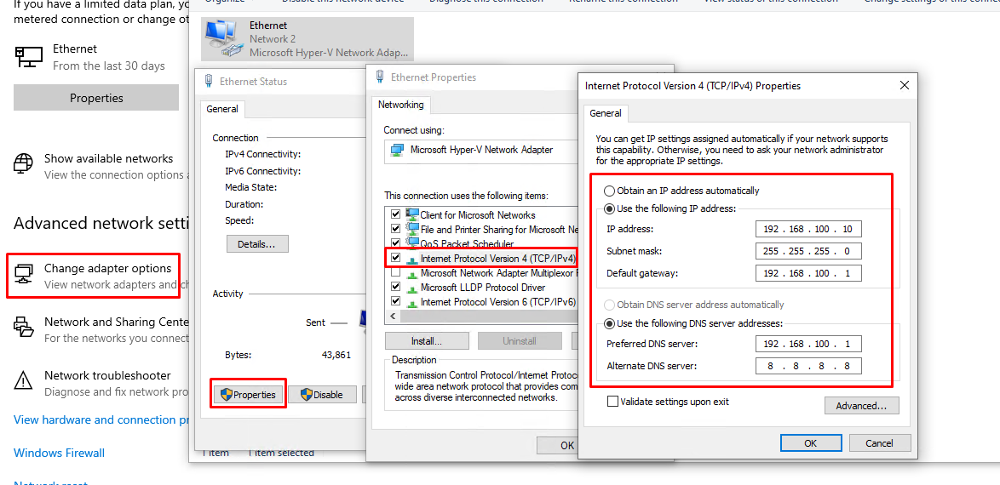

# Hyper-V 固定 IP

TLDR: Default Switch 用来上网, 新建 内部类型的 Switch 用来提供固定 IP

1. 在 Hyper-V 的虚拟交换机里面添加一个`内部网络(Internal)`来配置 NAT，我把它的名字设置为 `Static`

    

2. 打开适配器页面，选择当前联网的适配器，打开属性，选择分享网络给这个 NAT 交换机（这个步骤比较关键，做完才能让这个 NAT 访问外网）

    > 每个适配器只能分享网络给一个适配器，所以如果需要分享给多个适配器，需要选择这些适配器，右键桥接（Bridge），然后分享网络给这个网桥

    

3. 在宿主机选择 `Static` 适配器，打开属性中的 `IPv4`，适配器的 IP 段默认会被改成 `192.168.137.0/24`，可以自己改成其他的 IP 段（比如我改成 `192.168.100.1`）。要记住这个适配器的 IP，是这个 NAT 网络的网关。

    

4. 新建 VM 或打开已有的 VM 的设置，将网络适配器修改为 `Static`（如果没有网络适配器可以从添加硬件里面新建一个）。

    

5. 打开 VM，将网络手动配置成 `Static` 适配器所在的 IP 段，并且选择一个不冲突的内网 IP（下面还是展示 Windows 的配置）。

    

ref <https://chentanyi.github.io/2023/02/21/2023-02-21-hyperv-internal-static-ip/>
